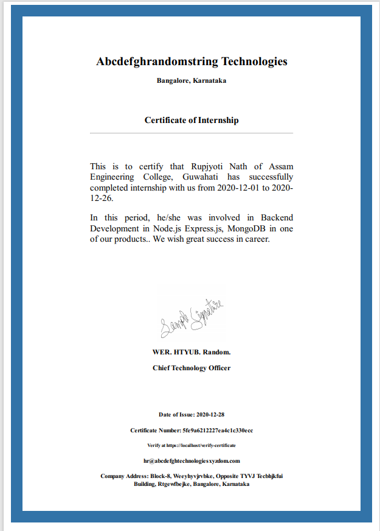

# CertificateVerifier-PDF-Email

This Microservice is responsible for generating a pdf of a newly issued internship certificate & email it.

For complete understanding of the project & more screenshots, visit my [CertificateVerifier](https://github.com/rupjyotinath/CertificateVerifier) repository first.

Here is a certificate's pdf that gets emailed,



This readme contains setting up this microservice only.

## Getting Started
### Installation & Setup

Clone or fork this repository.
Make sure to have Node.js & npm installed.

After navigating to the project directory,
```bash
npm install
```
to install the dependencies.


An Amazon SQS Queue should have already been created if you followed the instructions of the "CertificateVerifier" service (Amazon provides 12 months free tier).

An Yahoo email account needs to be created & create an additional password for 3rd party application. Yahoo doesn't allow to use the email password directly on softwares, need to create an additional one. (**Ofcourse, OAuth 2.0 will definitely be a much better choice instead of a password**)

The following environment variables are required:
* AWS_ACCESS_KEY_ID: AWS Key ID, should have already been setup in the other microservice
* AWS_SECRET_ACCESS_KEY: AWS Access Key, should have already been setup

(Note that these above credentials may differ from the other microservice depending on IAM policy/ user being used to run these two separate microservices. Only the Queue URL needs to be same.)

* AWS_SQS_QUEUE_URL: SQS QUEUE URL, should have already been setup
* USER: Yahoo email id (Other email can be used but code change required)
* PASSWORD: the 3rd party application access password

Rename the .sampleenv file to .env during development & put the values of the above environment variables.

### Running

```bash
node .
```
or 
```bash
node ./index.js
```

A start script may be defined in package.json .

## Usage

Once the app starts, it will continously listen for new messages (or certificates) published in the Queue. It will generate a pdf stream which will finally be emailed by nodemailer.

**Note: Pdf of certificates are not saved in disk. I feel it's unnecessary consumption of space, & not needed at all. Hence I pass a stream directly to nodemailer.**

## Notes/Improvements
* Can be modified to generate multiple types of certificates like "participation in workshop", webinar, etc.
* Can modify to send emails to admins after successful emailing of a certificate. (**This is another advantage of microservice, the certificate generation service doesn't care of who or how many admin's are present**)


## LICENSE
MIT

(C) 2020 Rupjyoti Nath

Third party packages have their own LICENCE terms.